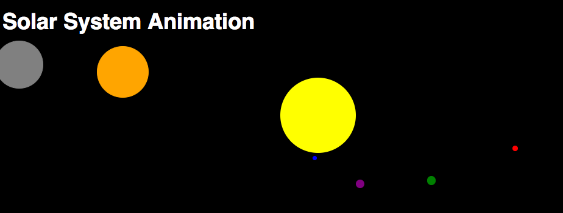

# Solar system animation

### 1. Global variables: 

* _grad2rad_: coefficient to convert degrees to radiant
* _ellipseSim_: to simulate elliptic orbit
* _velSyst_: velocity of solar system animation

### 2. Fixed variable of sun 
 element
* Sun Position
* Sun radius
* Sun Coordinates
* CSS style

### 3. Planet Object: 

Planet object has got a constructor function that creates the object inside a variable:
the constructor takes as inputs parameters of: 

1. name of the planet
2. radius
3. distance between a point on sun's circumference and the planet's one
4. initial angle
5. color (a string)

The update method is a function that increase the initial angle of a certain step (_**speedIncr**_) and returns the new position based on the the incremented angle.     

### 4. Rendering function:

The _render()_ function renders the image by using jQuery methods to control CSS style of each 
element by using proper parameters of each Planet instance.
Animation is done by using a callback inside the _**window.requestAnimationFrame(callback)**_. This method tells the browser that we want to render the animation and request that the browser calls a specific function that updates the animation before the next renderign. 
To do so, it's necessary that the _requestAnimationFrame_ method is called inside the callback routine itself. (Sample rate is 60fps).

